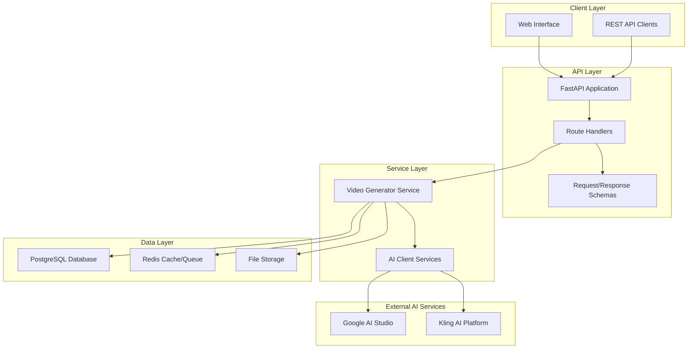

# AI Video Creator

> 🎬 **AI-powered video generation platform using Google AI Studio and Kling AI**

[](https://github.com/djyalu/ai_video_creator/actions)
[]()
[]()
[]()
[]()

## 🚀 What is AI Video Creator?

AI Video Creator is a modern, production-ready platform that transforms text prompts and images into high-quality videos using state-of-the-art AI technologies. Built with FastAPI and designed for scalability, it provides both REST APIs and a user-friendly interface for video generation.

## ✨ Key Features

### 🤖 AI-Powered Generation
- **Text-to-Video**: Transform descriptive text into cinematic videos
- **Image-to-Video**: Animate static images with natural motion
- **Prompt Enhancement**: Automatic optimization using Google AI Studio
- **Multiple Styles**: Realistic, anime, cartoon, cinematic, and artistic styles

### 🏗️ Production Architecture
- **FastAPI Backend**: High-performance async API with automatic documentation
- **Database Integration**: PostgreSQL with SQLAlchemy ORM
- **Background Processing**: Celery + Redis for async video generation
- **File Management**: Secure upload and storage handling
- **Health Monitoring**: Comprehensive health checks and metrics

### ☁️ Cloud-Native Deployment
- **Docker Support**: Multi-stage builds for optimized images
- **GitHub Actions**: Automated CI/CD pipeline
- **Render.com Ready**: One-click deployment configuration
- **Auto Scaling**: Horizontal scaling support

### 🔧 Developer Experience
- **Type Safety**: Full TypeScript-like experience with Pydantic
- **API Documentation**: Auto-generated OpenAPI/Swagger docs
- **Testing Suite**: Comprehensive test coverage
- **Code Quality**: Automated linting, formatting, and security scans

## 🎯 Quick Start

### 1. Clone & Setup
```bash
git clone https://github.com/djyalu/ai_video_creator.git
cd ai_video_creator/ai_video_creator
python -m venv .venv
source .venv/bin/activate  # Linux/Mac
pip install -r requirements.txt
```

### 2. Configure Environment
```bash
cp .env.example .env
# Edit .env with your API keys:
# - GOOGLE_AI_API_KEY
# - KLING_API_ACCESS_KEY
# - KLING_API_SECRET_KEY
```

### 3. Run Application
```bash
python -m app.main
# Or with hot reload:
uvicorn app.main:app --reload
```

### 4. Access APIs
- **API Documentation**: http://localhost:8000/docs
- **Health Check**: http://localhost:8000/health
- **Video Generation**: POST /api/v1/video/generate/text

## 📊 API Examples

### Generate Video from Text
```python
import httpx

async with httpx.AsyncClient() as client:
    response = await client.post(
        "http://localhost:8000/api/v1/video/generate/text",
        json={
            "prompt": "A serene sunset over calm ocean waters",
            "duration": 5,
            "style": "cinematic",
            "quality": "high"
        }
    )
    result = response.json()
    print(f"Job ID: {result['job_id']}")
```

### Check Job Status
```python
job_id = "your-job-id"
response = await client.get(f"http://localhost:8000/api/v1/status/jobs/{job_id}")
status = response.json()
print(f"Status: {status['status']}")
```

## 🏗️ Architecture Overview



## 🚀 Deployment Options

### Render.com (Recommended)
- **Zero Configuration**: Uses included `render.yaml`
- **Auto Scaling**: Built-in horizontal scaling
- **PostgreSQL**: Managed database included
- **SSL**: Automatic HTTPS certificates

### Local Docker
```bash
docker-compose up -d
```

### Manual Deployment
See [Deployment Guide](deployment/render.md) for detailed instructions.

## 📝 Documentation

- **[API Reference](api/overview.md)**: Complete REST API documentation
- **[Architecture Guide](architecture/overview.md)**: System design and patterns
- **[Development Setup](development/contributing.md)**: Contributing guidelines
- **[Deployment Guide](deployment/render.md)**: Production deployment

## 🤝 Contributing

We welcome contributions! Please see our [Contributing Guide](development/contributing.md) for details.

### Development Workflow
1. Fork the repository
2. Create a feature branch
3. Make your changes with tests
4. Run quality checks: `make lint test`
5. Submit a pull request

## 📊 Project Status

- ✅ **Core API**: Complete with video generation endpoints
- ✅ **AI Integration**: Google AI Studio and Kling AI clients
- ✅ **Database**: PostgreSQL with SQLAlchemy models
- ✅ **Testing**: Comprehensive test suite
- ✅ **CI/CD**: GitHub Actions pipeline
- ✅ **Documentation**: Complete API and architecture docs
- 🚧 **Web Interface**: In development
- 📋 **Advanced Features**: Storyboard generation, batch processing

## 📄 License

This project is licensed under the MIT License - see the [LICENSE](LICENSE) file for details.

## 🙏 Acknowledgments

- **Google AI Studio**: For advanced prompt enhancement capabilities
- **Kling AI**: For state-of-the-art video generation technology
- **FastAPI**: For the excellent async web framework
- **Render.com**: For seamless cloud deployment platform